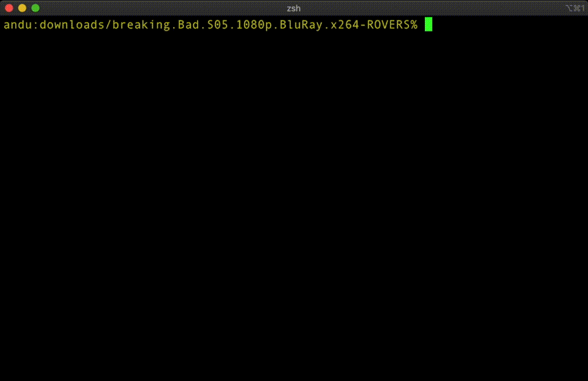

# Subtitles CLI

A full featured, easy to use, CLI app to download subtitles from opensubtitles.org.



## Features

-  🎞 Download subtitles for a movie file or an entire folder of video files
-  ⌨️ Login with your opensubtitles.org account
-  🏝 Stores preferences for language and opensubtitles.org account
-  ⚔️ Secure! Your account credentials are stored encrypted by your operating system using Keychain/Credential Vault/Secret Service API
-  ⌛️ Shows download quota from opensubtitles.org

## Install

```shell script
npm install -g subs-cli
```

If you encounter EACCES error on Mac OS read [Installation Problems](#installation-problems) section. 

## Usage

##### Download subtitles for all the video files in a directory
```
subs /path/to/dir
```

##### Download subtitles for a single video file
```
subs /path/to/file.mkv
```

##### Help
```
subs -h

Usage: subs <path> [options]

Options:
  -V, --version       output the version number
  -l, --lang <value>  the language of the subtitles (eng/en, fr/fre, ro/rum,
                      ...) (default: eng)
  -o, --overwrite     overwrite existing subtitles (default: false)
  -p, --path          path of file or dir of files to download subtitles for
  -s, --save-lang     save the current language as default
  -h, --help          display help for command
```

##### Save language

If a language is specified with **--lang** option, using **--save-lang** flag will save it as the default language
 
##### Overwrite

Using **--overwrite** flag will download and overwrite existing subtitles. Default behaviour is to ignore videos that already have subtitles.

## Installation problems

### Mac OS

For MacOS npm installs global packages into /usr/local/lib/node_modules. You might need to run the install with sudo.

```shell script
sudo npm install -g subs-cli
```

That might cause another problem, as npm drops the sudo privileges for packages that run scripts, and sets the user to "nobody".
This will cause **keytar** (the package that manages the secure storage of account passwords) 
to not be able to install it's prebuilt native modules, as it cannot create a folder for them. 

The only workarounds are to either change the ownership of **node_modules** dir, and install
npm global packages without sudo
```shell script
sudo chown -R yourusername:admin /usr/local/lib/node_modules
npm install -g subs-cli
```

or run the npm install command with --unsafe-perm
```shell script
sudo npm install -g --unsafe-perm subs-cli
```

I am actively looking for a better workaround. More info [here](https://stackoverflow.com/questions/47252451/permission-denied-when-installing-npm-modules-in-osx).

## License

The code in this project is licensed under the MIT License. See [LICENSE](LICENSE) for details.